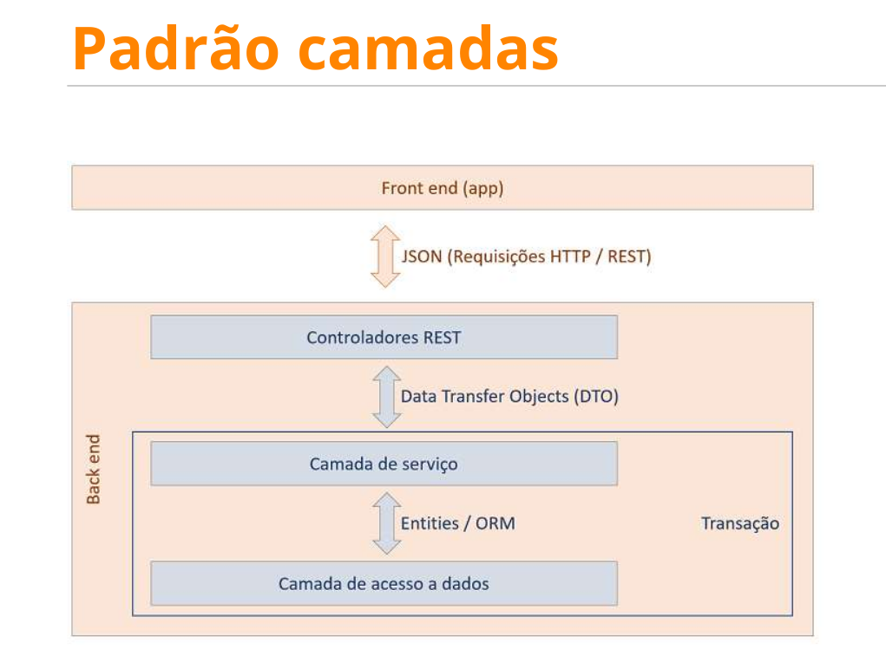

# Intensivão Java com Spring
## Projeto de uma API de uma coleção de jogos

- Este projeto de estudo está preparado para ser usado em três perfis de uso: `test`, `dev` e `prod`.
- Pode ser utilizado com o banco de dados `H2`, cujas configurações estão incluídas no projeto.
- Suporte para uso via `Docker`, configurando um ambiente com um servidor `PostgreSQL` e a interface de gerenciamento `pgAdmin`, criando uma rede `bridge` compartilhada para que ambos os serviços possam se comunicar.
- O arquivo `DSList` pode ser importado pelo `Postman` para facilitar o uso dos endpoints da API.
- Implementa `CORS` para restringir o acesso à API.

## Requisitos de Sistema
- **Java 21** 
- **Maven** instalado
- **Docker** e **Docker Compose** instalados
- **Postman** para testar os endpoints (opcional)

## Ferramentas Usadas
- **Java 21**
- **Spring Boot**
- **Maven**
- **PostgreSQL**
- **SQL**
- **pgAdmin4**
- **Docker Compose**
- **Postman**
- **H2**

## Configuração do Ambiente
### Usando Docker
1. Certifique-se de que o Docker e o Docker Compose estão instalados.
2. No diretório raiz do projeto, execute:
    ```bash
    docker-compose up -d
    ```
3. Acesse o pgAdmin em `http://localhost:5050` e use as credenciais:
    - Email: `me@example.com`
    - Senha: `1234567`

### Executando Localmente com H2
1. No diretório raiz do projeto, execute:
    ```bash
    mvn spring-boot:run -Dspring-boot.run.profiles=test
    ```

## Modelo de Domínio


## Padrão de Camadas


## Exemplos de Requisições
### Obter Lista de Jogos
- **Endpoint**: `GET /games`
- **Exemplo de Resposta**:
    ```json
    [
        {
            "id": 1,
            "title": "Mass Effect Trilogy",
            "year": 2012,
            "imgUrl": "https://raw.githubusercontent.com/devsuperior/java-spring-dslist/main/resources/1.png",
            "shortDescription": "Lorem ipsum dolor sit amet..."
        },
        ...
    ]
    ```

## Importar Coleção no Postman
1. Abra o Postman.
2. Clique em `Import` e selecione o arquivo `DSList.postman_collection.json`.
3. A coleção aparecerá na sua lista de coleções do Postman.

## Dicas e Resolução de Problemas
- **Problema**: O container do pgAdmin não inicia.
  - **Solução**: Verifique se o Docker está em execução e se as portas 5050 e 5433 estão livres.

- **Problema**: Não consigo acessar o banco de dados PostgreSQL.
  - **Solução**: Certifique-se de que o serviço PostgreSQL está rodando e que as credenciais estão corretas.

## Endpoints da API

### Para mudar a posição de um jogo na lista
**POST** `http://localhost:8080/lists/2/replacement`

### Para trazer a lista de cada tipo
**GET** `http://localhost:8080/lists`

### Para trazer a lista completa de cada tipo
**GET** `http://localhost:8080/lists/2/games`

### Para trazer game por Id
**GET** `http://localhost:8080/games/1`

### Para trazer a lista completa
**GET** `http://localhost:8080/games`
